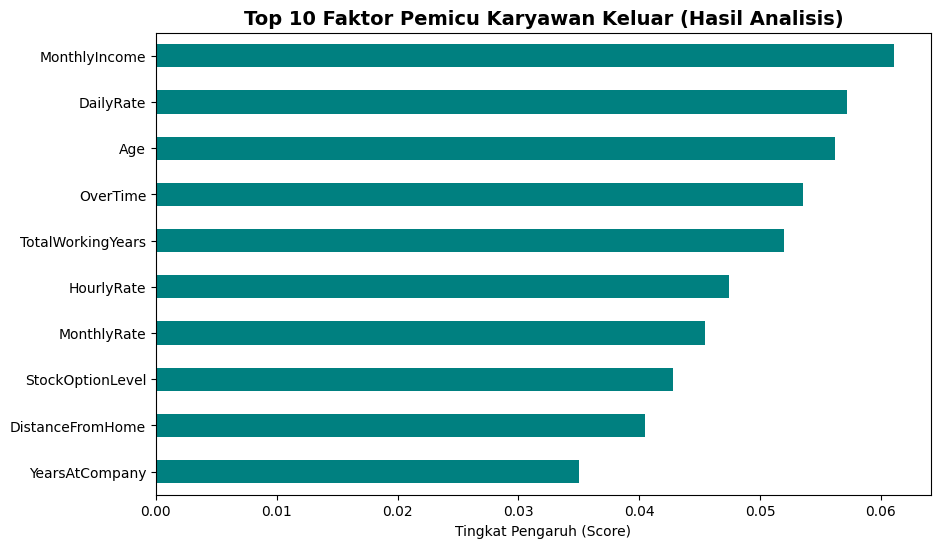
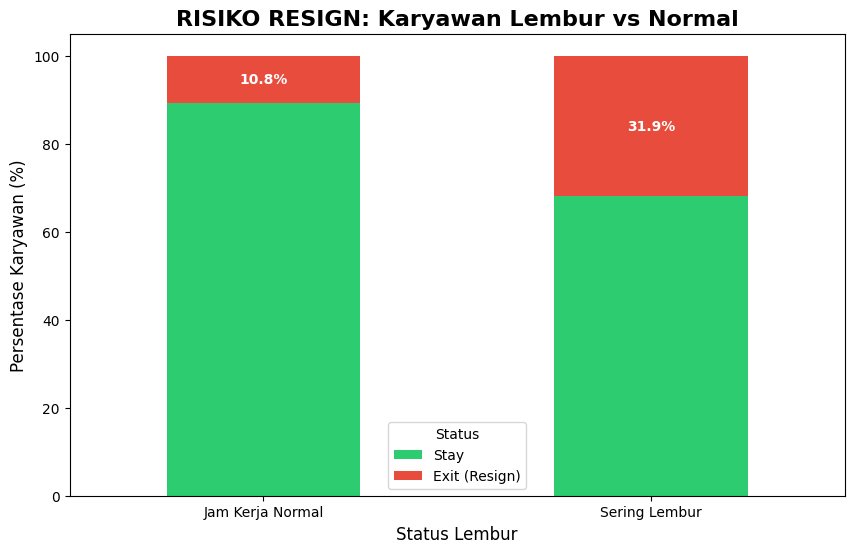
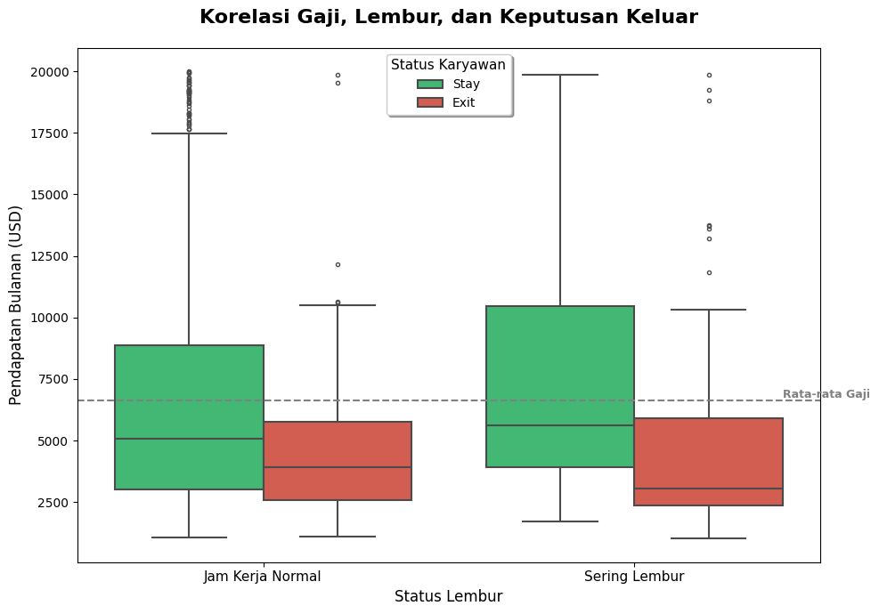

# Proyek Akhir: Menyelesaikan Permasalahan Perusahaan Edutech

## Business Understanding

**Jaya Jaya Maju** adalah sebuah perusahaan multinasional yang telah beroperasi sejak tahun 2000. Dengan skala bisnis yang besar, perusahaan ini memiliki lebih dari 1000 karyawan yang tersebar di seluruh negeri. Sebagai perusahaan besar, reputasi dan keberlanjutan operasional sangat bergantung pada stabilitas sumber daya manusianya.

### Permasalahan Bisnis

Masalah utama yang dihadapi adalah **tingginya tingkat attrition rate (rasio karyawan yang keluar) yang mencapai lebih dari 10%.** Angka ini dianggap mengkhawatirkan karena dapat mengganggu produktivitas, meningkatkan biaya rekrutmen dan pelatihan karyawan baru, serta berpotensi menghilangkan talenta-talenta terbaik yang dimiliki perusahaan.

### Cakupan Proyek

Proyek ini mencakup beberapa tahapan utama menggunakan pendekatan Data Science:

- **Preprocessing:** Membersihkan data dari missing values, menghapus fitur yang tidak relevan, dan melakukan encoding pada fitur kategori agar dapat diproses oleh algoritma.

- **Exploratory Data Analysis (EDA):** Melakukan visualisasi data untuk menemukan tren dan korelasi antara atribut karyawan (seperti gaji, lembur, dan usia) dengan status attrition.

- **Modeling:** Membangun model prediksi menggunakan algoritma *Random Forest Classifier* dengan penyeimbang kelas (balanced class weight) untuk mendeteksi risiko karyawan keluar secara akurat.

- **Dashboarding:** Menyusun visualisasi yang mudah dipahami untuk memonitor faktor-faktor pemicu utama attrition.

- **Evaluating:** Memberikan rekomendasi strategis kepada departemen HR berdasarkan temuan data.

### Persiapan

Sumber data: ``https://github.com/Fayshal697/Dicoding_Menyelesaikan-Permasalahan-HR_fayshalkaran97/blob/main/employee_data.csv``

Setup environment:

```
pip install pandas numpy matplotlib seaborn scikit-learn
```

## Business Dashboard







Berdasarkan dashboard di atas, berikut adalah penjelasan faktor-faktor kritis:

- **Faktor Pemicu Utama (Feature Importance):** Berdasarkan hasil model, **Monthly Income (Pendapatan) dan Age (Usia)** merupakan dua faktor teratas yang memengaruhi keputusan karyawan untuk keluar.

- **Risiko Lembur (OverTime):** Visualisasi menunjukkan bahwa **30.1% karyawan yang sering lembur memutuskan untuk keluar**, angka ini 3 kali lipat lebih tinggi dibandingkan karyawan dengan jam kerja normal (10.4%). Ini membuktikan beban kerja berlebih adalah pemicu burnout.

- **Korelasi Gaji & Lembur:** Ditemukan bahwa karyawan yang keluar (warna merah) cenderung memiliki pendapatan di bawah rata-rata perusahaan, terutama mereka yang juga dibebani tugas lembur. Gaji yang tidak kompetitif memperparah dampak negatif dari beban kerja.


## Conclusion

Proyek ini menyimpulkan bahwa tingginya attrition rate di Jaya Jaya Maju dipicu oleh kombinasi faktor finansial dan kesejahteraan kerja. Karyawan dengan pendapatan rendah dan beban lembur tinggi adalah kelompok yang paling rentan untuk keluar.

Implementasi business dashboard dan model prediksi ini sangat krusial sebagai sistem peringatan dini (Early Warning System). Dengan memvisualisasikan faktor risiko secara real-time, perusahaan dapat beralih dari kebijakan reaktif menjadi preventif, sehingga mampu menekan angka attrition, menjaga talenta terbaik, dan memastikan stabilitas operasional jangka panjang.

### Rekomendasi Action Items (Optional)

Berdasarkan temuan di atas, berikut adalah rekomendasi strategis untuk manajemen:

1. **Evaluasi Struktur Kompensasi:** Melakukan penyesuaian gaji (salary adjustment) terutama pada level staf yang memiliki pendapatan di bawah rata-rata industri untuk meningkatkan daya saing perusahaan.
2. **Manajemen Beban Kerja (Overtime Control):** Mengurangi ketergantungan pada lembur dengan melakukan audit beban kerja atau menambah staf di departemen dengan tingkat lembur tertinggi.
3. **Fleksibilitas Kerja:** Mempertimbangkan kebijakan Work From Home (WFH) atau jam kerja fleksibel bagi karyawan yang memiliki jarak tempuh rumah ke kantor yang jauh guna mengurangi tingkat stres perjalanan.
4. **Program Retensi Karyawan Muda:** Membuat jalur karir yang lebih jelas dan program pengembangan bakat untuk mengikat loyalitas karyawan di rentang usia muda yang secara data memiliki mobilitas tinggi.